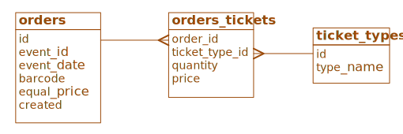
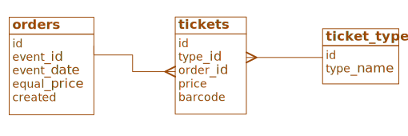

## Установка

1. Создать в БД таблицу `orders` используя файл `create_orders_table.sql`
2. Настроить подключение к БД в файле `db_settings.php`

## Использование

1. Открыть `index.php` в браузере
2. Заполнить форму, указав необходимые данные в правильном формате
3. Нажать кнопку "Добавить"

## Структура проекта
1 задание:
- `index.php` - главная страница с формой
- `store.php` - обработчик формы
- `db_settings.php` - настройки подключения к базе данных
- `mock_api.php` - имитация API для бронирования и подтверждения

2 задание:
- `21.sql` - SQL-код создания таблиц для задания 2.1
- `22.sql` - SQL-код создания таблиц для задания 2.2
- `task2images` - папка с картинками для пояснений

## Решение задания №1

Основной код находится в файле `store.php`. Он включает в себя несколько этапов:
1. Задание параметров работы алгоритма, таких как длина штрих-кода и максимальное количество попыток отправить штрих-код на API бронирования.\
Так как в соответствии с заданием, при получении в ответ ошибки, нужно повторить запрос, то ограничение количества попыток позволит избежать бесконечного повторения в случае, если API будет постоянно возвращать ошибки.
2. Подключение к БД.
3. Приём данных с формы, их фильтрация.
    - Для числовых значений используется проверка их соответствия типу int.
    - Для даты выполняются две проверки:
        1. Соответствие формату даты. Проверяется с помощью регулярного выражения, однако позволяет ввести дату в правильном формате, но с неправильными значениями, например, `2024-10-35 18:90:90`.
        2. Проверка значения даты. Выполняется попытка создать объект DateTime и ловятся исключения, возникающие при передаче в его конструктор неправильных значений. Если использовать только эту проверку без предыдущего пункта, то значения типа `2024-10-29 18:3:0` также будут приняты, хоть и не совсем корректны.
4. Генерация штрих-кода. Вынесена в отдельную функцию, так как используется в двух местах. Функция в цикле генерирует случайные числа от 0 до 9 и добавляет их к строке штрих-кода.
5. Отправка первого запроса к API бронирования.
   - Формируется массив ['ключ' => $значение]
   - Массив представляется в формате JSON
   - Вызывается функция, имитирующая отправку запроса, которая также возвращает ответ в формате JSON
   - Ответ преобразуется из JSON в ассоциативный массив
6. Проверка ответа.\
Если в полученном массиве есть элемент с названием `error`, то генерируется новый штрих-код и отправка запроса повторяется.\
Цикл продолжает повторяться пока в массиве, полученном в ответ, есть элемент `error`, либо пока количество повторений не превысит заданное максимально допустимое.
7. Как только в ответ придёт `message` вместо `error`, происходит отправка следующего запроса, аналогичным предыдущему образом. Однако в данном случае не требуется повторная отправка при получении ошибки, поэтому цикл не используется.\
В зависимости от результатов запроса либо происходит переход к сохранению данных в БД, либо пользователю выдаётся ошибка.

_Ошибки_\
_Для отображения на форме текста ошибок, используется механизм сессий. При необходимости передать данные на форму, с которой был отправлен запрос, эти данные помещаются в сессию в переменную с именем `error`, `warning` или `message`, затем происходит переход на страницу с формой, а выполнение программы прерывается._

8. Для сохранения данных в БД сначала создаётся подготовленный запрос на вставку, а затем в него добавляются конкретные данные, которые нужно внести в таблицу.
Вставка в таблицу двух заказов с одинаковыми номерами (id) невозможна из-за ограничений первичного ключа. Для того, чтобы предотвратить потенциальную проблему, когда несколько запросов выполняются одновременно и могут привести к дублированию первичного ключа, операция вставки находится внутри транзакции, которая будет откачена в случае возникновения ошибки.

## Решение задания №2.1

Для хранения разных типов билетов необходимо создать новую таблицу, например `ticket_types`, со следующими столбцами:
- id - первичный ключ
- type_name - название типа, например "детский", "льготный" и т.д.

Данная таблица будет связана с заказами связью "многие-ко-многим", а значит нужно создать ещё одну, промежуточную таблицу, например `orders_tickets`, со следующими столбцами:
- order_id
- ticket_type_id - вместе с предыдущим образуют составной первичный ключ
- quantity - количество билетов конкретного типа в конкретном заказе
- price - цена билетов конкретного типа в конкретном заказе

Соответственно из таблицы `orders` можно убрать столбцы, касающиеся типов билетов и цен на них.\
Итоговая схема:



## Решение задания №2.2
Для того, чтобы хранить отдельно штрих-код каждого билета, нужно создать отдельную таблицу билетов `tickets`, со следующими столбцами:
- id - первичный ключ
- type_id - внешний ключ, ссылающийся на таблицу `ticket_types` из предыдущего задания
- order_id - внешний ключ, ссылающийся на таблицу `orders`
- price - цена билета
- barcode - штрих-код одного конкретного билета. Из таблицы `orders` его нужно убрать.

Итоговая схема:



Столбец `quantity` теперь можно не использовать, так как количество билетов любого типа можно посчитать:

``` sql
SELECT orders.id, type_name, COUNT(*) AS `quantity`
FROM orders
	INNER JOIN tickets
		ON orders.id = tickets.order_id
	INNER JOIN ticket_types
		ON ticket_types.id = tickets.type_id
GROUP BY orders.id, type_name`
```